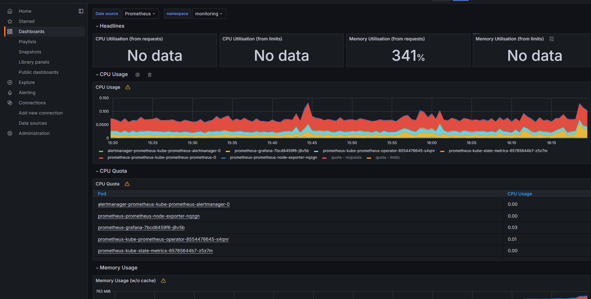
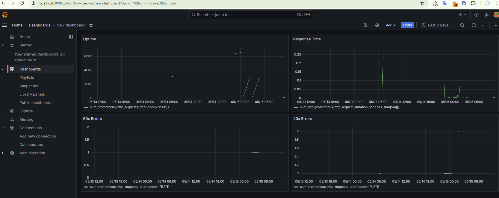
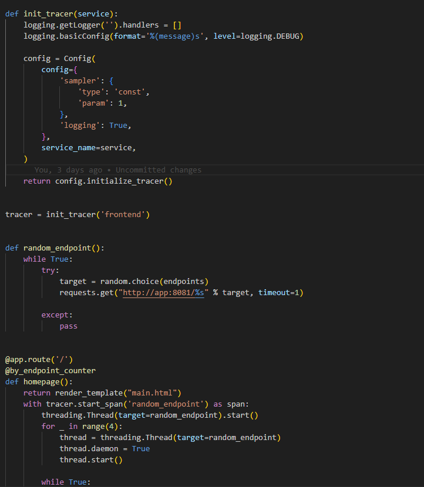
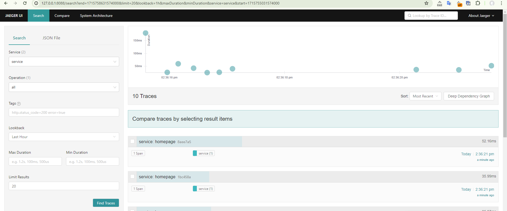
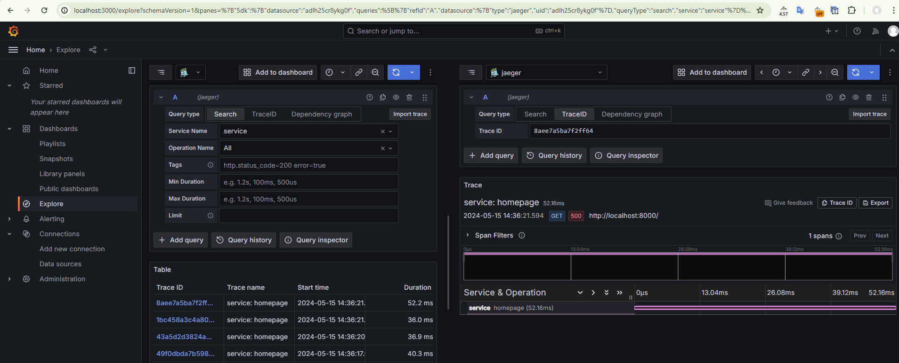
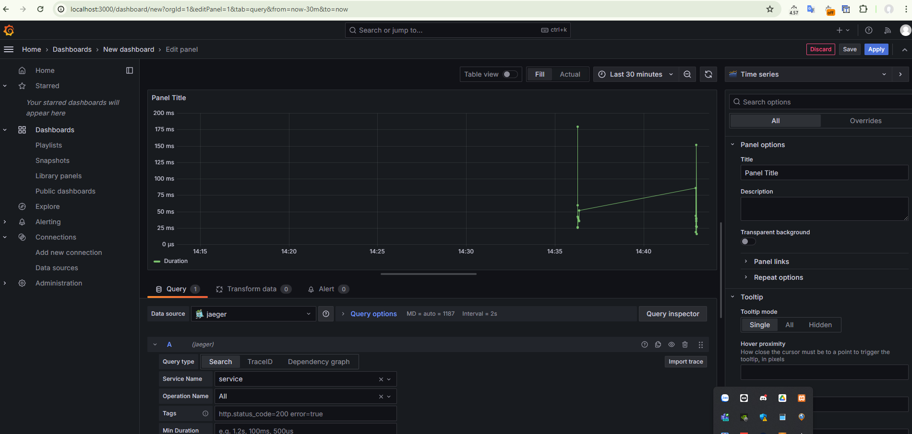
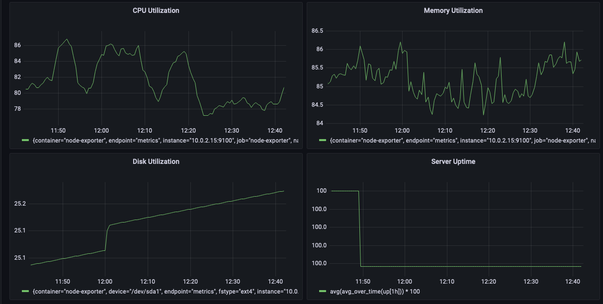
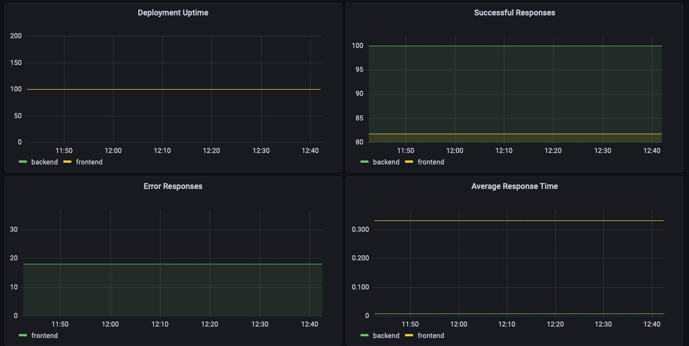

## Verify the monitoring installation

### Monitoring Namespace

The following image shows the output for the `monitoring` namespace:

### Observability Namespace

The following image shows the output for the `observability` namespace:

### Default Namespace

The following image shows the output for the `default` namespace:

## Setup the Jaeger and Prometheus source

Expose Grafana to the internet and then setup Prometheus as a data source. The following image shows the home page of Grafana after logging in:

## Create a Basic Dashboard

## Describe SLO/SLI

- **SLOs** specify the level of performance or reliability a service should provide.
- **SLIs** are metrics that measure the performance and reliability of a service or system.
- For **request response time SLO**, SLIs might include average, maximum, and minimum response times, and the percentage of requests meeting the response time threshold.
- For **monthly uptime SLO**, SLIs might include successful requests, failed requests, error codes, and total uptime.

## Creating SLI metrics.

- **Latency:** Measures time taken for request completion.
- **Error rate:** Measures percentage of requests resulting in error.
- **Availability:** Measures percentage of time the service is available.
- **Throughput:** Measures number of requests per unit of time.
- **Network capacity:** Measures resource utilization, such as CPU or memory

## Create a Dashboard to measure our SLIs

## Tracing our Flask App

#### Frontend app.py

#### Bacnend app.py

#### Jaeger UI

#### Grafana Jaeger Trace

## Jaeger in Dashboards

## Report Error

TROUBLE TICKET

Name: Request endpoint star fail throw 405 Method Not Allowed

Date: May 05 2024, 14:30 PM

Subject: Backend can't acces MongoDB

Affected Area: Backend Service

Severity: High

Description: As we port-forwarding the application accessing /star endpoint, it throw 405 error which is caused by the mongodb://example-mongodb-svc.default.svc.cluster.local:27017/example-mongodb URL is not exist in the cluster. We need to make the MongoDB URL available for the cluster.

## Creating SLIs and SLOs

- Uptime. SLI: Uptime of the application availability per month. SLO: Uptime of the application - 99.95%.
- Latency. SLI: Average response time per 30 seconds periods per month. SLO: Average response time per 30 sec periods per month less than 100ms. SLI: Percentage of request count which complete in less than 100ms. SLO: 99% of request count will complete in less than 100ms.
- Errors. SLI: HTTP 500 errors % rate per 1 minute ranges. SLO: HTTP 500 errors % rate per 1 minute is less than 1%.
- Traffic. SLI: Total requests per minute. SLO: Total requests per minute is less than 1800.

## Building KPIs for our plan

- Error Rate: This KPI was selected because more than 95% of all requests must be completed without errors. As a result, we will be able to track our application's error rate.
- Uptime: This KPI was chosen since there must be at least 99% uptime every month. The uptime KPI enables us to correctly measure these variables.
- Resource capacity: This KPI was chosen since CPU and RAM utilization should not surpass 90% per month. The Resource Capacity KPI enables us to monitor their utilization.

## Final Dashboard

