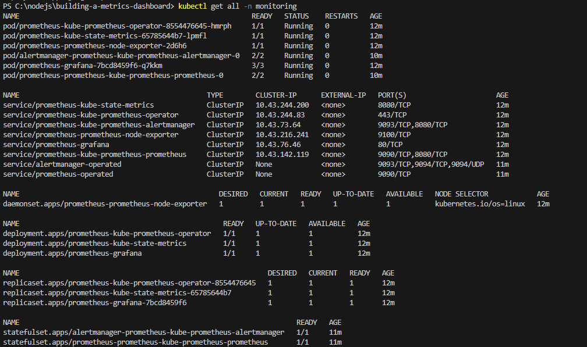
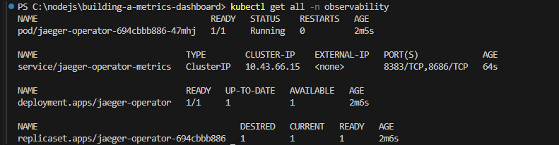
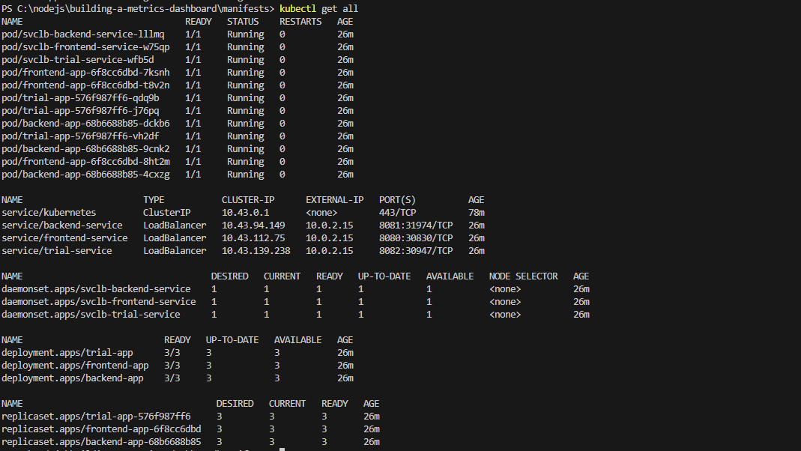
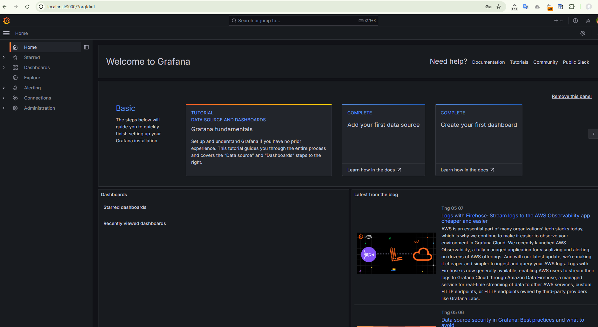

## Verify the monitoring installation

### Monitoring Namespace

The following image shows the output for the `monitoring` namespace:

### Observability Namespace

The following image shows the output for the `observability` namespace:

### Default Namespace

The following image shows the output for the `default` namespace:

## Setup the Jaeger and Prometheus source

Expose Grafana to the internet and then setup Prometheus as a data source. The following image shows the home page of Grafana after logging in:

## Create a Basic Dashboard

_TODO:_ Create a dashboard in Grafana that shows Prometheus as a source. Take a screenshot and include it here.

## Describe SLO/SLI

- **SLOs** specify the level of performance or reliability a service should provide.
- **SLIs** are metrics that measure the performance and reliability of a service or system.
- For **request response time SLO**, SLIs might include average, maximum, and minimum response times, and the percentage of requests meeting the response time threshold.
- For **monthly uptime SLO**, SLIs might include successful requests, failed requests, error codes, and total uptime.

## Creating SLI metrics.

- **Latency:** Measures time taken for request completion.
- **Error rate:** Measures percentage of requests resulting in error.
- **Availability:** Measures percentage of time the service is available.
- **Throughput:** Measures number of requests per unit of time.
- **Network capacity:** Measures resource utilization, such as CPU or memory

## Create a Dashboard to measure our SLIs

_TODO:_ Create a dashboard to measure the uptime of the frontend and backend services We will also want to measure to measure 40x and 50x errors. Create a dashboard that show these values over a 24 hour period and take a screenshot.

## Tracing our Flask App

_TODO:_ We will create a Jaeger span to measure the processes on the backend. Once you fill in the span, provide a screenshot of it here. Also provide a (screenshot) sample Python file containing a trace and span code used to perform Jaeger traces on the backend service.

## Jaeger in Dashboards

_TODO:_ Now that the trace is running, let's add the metric to our current Grafana dashboard. Once this is completed, provide a screenshot of it here.

## Report Error

_TODO:_ Using the template below, write a trouble ticket for the developers, to explain the errors that you are seeing (400, 500, latency) and to let them know the file that is causing the issue also include a screenshot of the tracer span to demonstrate how we can user a tracer to locate errors easily.

TROUBLE TICKET

Name:

Date:

Subject:

Affected Area:

Severity:

Description:

## Creating SLIs and SLOs

_TODO:_ We want to create an SLO guaranteeing that our application has a 99.95% uptime per month. Name four SLIs that you would use to measure the success of this SLO.

## Building KPIs for our plan

_TODO_: Now that we have our SLIs and SLOs, create a list of 2-3 KPIs to accurately measure these metrics as well as a description of why those KPIs were chosen. We will make a dashboard for this, but first write them down here.

## Final Dashboard

_TODO_: Create a Dashboard containing graphs that capture all the metrics of your KPIs and adequately representing your SLIs and SLOs. Include a screenshot of the dashboard here, and write a text description of what graphs are represented in the dashboard.
